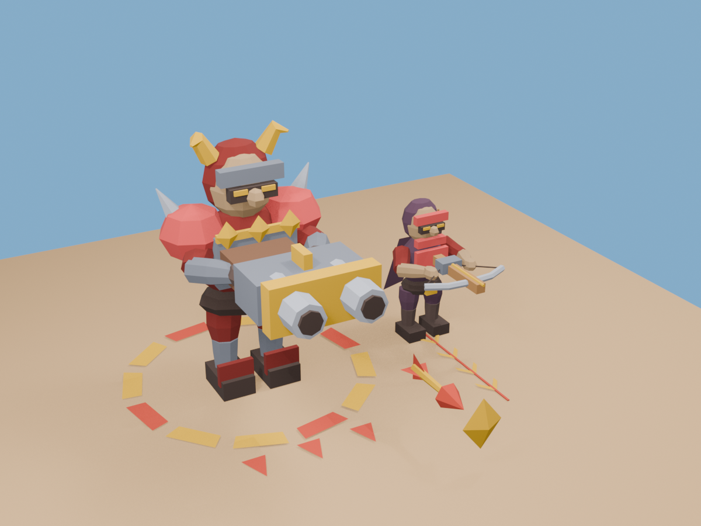

# Модели Runner Forge R2

Пакет добавляет стрелка, босса, отдельный снаряд, полосу прицеливания, кольцо предупреждения и метку попадания. Стиль и материалы соответствуют R1. Босс содержит три независимо отключаемых узла меток; персонажи имеют 14 анимационных клипов в сумме.

- Готовые runtime-модели: [`public/models/r2/`](../../../public/models/r2/).
- Шесть редактируемых исходников Blender: [`assets/models/r2/`](../../../assets/models/r2/).
- Сокеты, клипы, координаты, метки и самостоятельный снаряд: [контракт](contract.md).
- Хэши runtime GLB и имена клипов: [manifest.json](../../../public/models/r2/manifest.json).
- Фактические проверки Blender/GLB: [verification.json](verification.json).

Все GLB проверены независимым повторным импортом и оценкой каждого кадра анимации. Исходники отдельно открыты в Blender 5.2.1 LTS. В репозитории уже реализованы боевые правила R2 с техническим отображением стрелка и босса. Эта поставка добавляет новые модели для подключения к клиенту. Замена технических моделей, связь 14 клипов с событиями боя, три попадания по боссу и сохранение выпущенного снаряда после смерти стрелка требуют проверки в клиенте после импорта; такая интеграционная проверка в рамках поставки ассетов не выполнялась. Числа GDD P09/P10 остаются предложениями.

В `public` входят только файлы для доставки клиенту. Исходники Blender и иллюстрация находятся вне `public`. Старые модели R1 остаются зависимостью релиза R2.

Пользовательский комплект 2D-графики R2 сохранён отдельно в [`assets/graphics/r2/`](../../../assets/graphics/r2/README-R2.md): UI, декали, спрайты VFX, атласы и `events.json`. Его исходные относительные ссылки и файлы сохранены. [Проверка копирования и декодирования](graphics-delivery.json). Материалы GLB остаются геометрическими; декали из нового комплекта ещё не нанесены.
