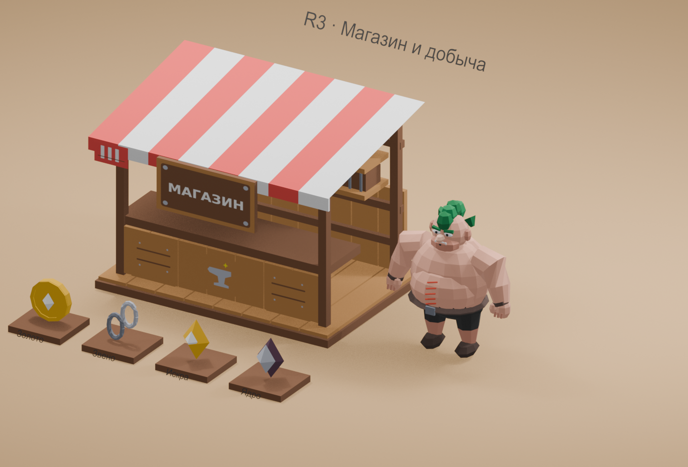
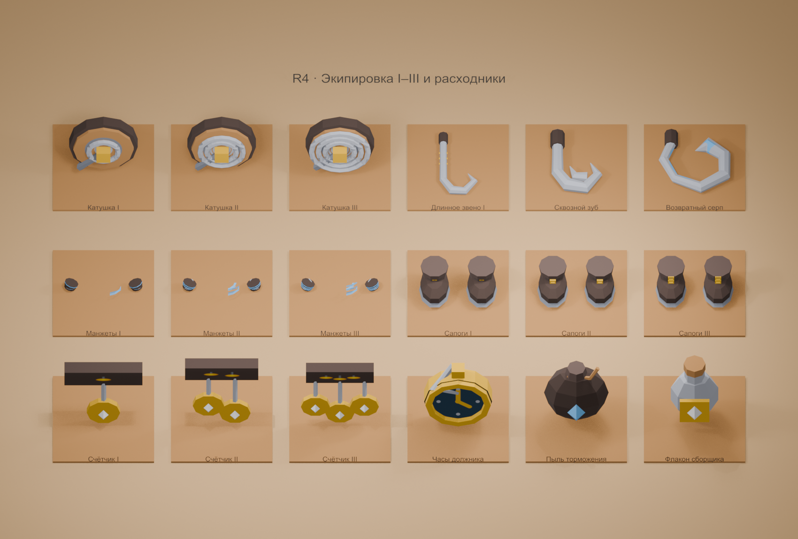
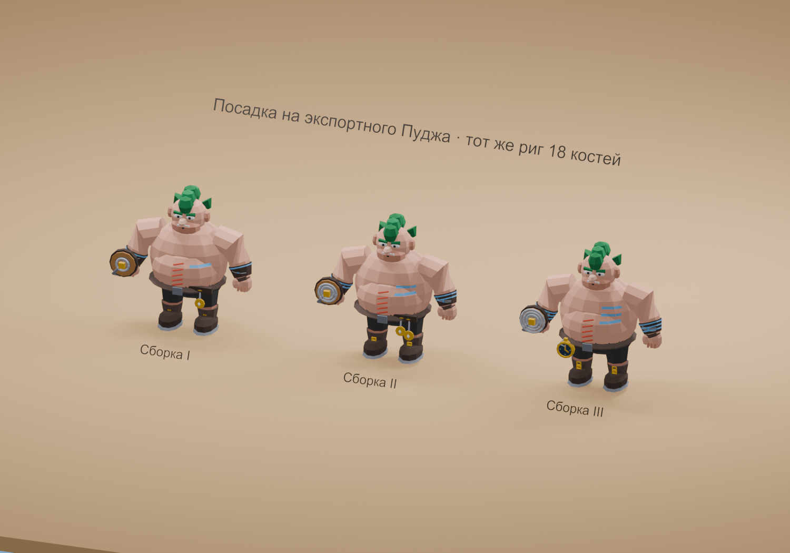

# Модели Runner Forge R3–R4

Опубликованы 24 модели: R3 — Пудж с 11 клипами, магазин, золото, сталь, искра и ядро; R4 — 16 вариантов экипировки и два расходника. 13 носимых моделей используют точную привязку к 18 костям `pudge_r3`. Геометрия уровней I–III отличается витками, полосами, пряжками и подвесками.

- Runtime GLB: [R3](../../../public/models/r3/) и [R4](../../../public/models/r4/).
- Редактируемые исходники: [R3](../../../assets/models/r3/) и [R4](../../../assets/models/r4/); [native для повторного экспорта](../../../assets/models/native/).
- [Общая Blender-сцена](../../../assets/models/r3-r4/Runner-Forge-R3-R4.blend): обзоры R3/R4, три экипированные сборки и последовательность всех 11 клипов.
- Исходная графика: [179 файлов R3](../../../assets/graphics/r3/) и [196 файлов R4](../../../assets/graphics/r4/), без изменений. [20 производных декалей](../../../assets/models/r3-r4/derived-textures/) встроены в GLB и .blend.
- [Контракт подключения](contract.md), [индекс ассетов](asset-index.json), [проверка копий Blender](blender-verification.json), [manifest опубликованных файлов](publication-manifest.json).

GLB используют метры, Y вверх и +Z вперёд. Дополнительный разворот на π не требуется. Носимые модели находятся в bind space полного героя; переиспользуйте скелет Пуджа по joint names/indices, rest и inverse-bind, без дополнительного parenting всего предмета к socket. Три крюка имеют `hook_root`, `socket_chain_hook` и `socket_target_hook`. Катушки используют уже опубликованные базовые [крюк](../../../public/models/r1/hook.glb) и [цепь](../../../public/models/r1/chain.glb).

Готовые GLB занимают 1 395 124 байта и 9 354 треугольника суммарно со всеми альтернативными уровнями. Пудж с максимальным одиночным комплектом — до 4 578 треугольников. Проверены все кадры 11 клипов, bind/веса 13 предметов, отдельные .blend и общая сцена. В публикационных копиях .blend пути к упакованным текстурам/шрифтам сделаны относительными, сохранённые каталоги файлового браузера очищены; геометрия, риг, кривые анимаций и встроенные ресурсы сверены до и после сохранения.

Модели доступны для подключения. Игровая симуляция и загрузчик этим коммитом не изменяются. Подключение этих моделей к магазину, экипировке и расходникам, внутриигровая камера и FPS телефона требуют игровой приёмки. Механика определяется документацией и подтверждённым каталогом клиента; графические P14/P16 сами её не утверждают. Посадка рассмотрена на Пудже; нулевые пересечения поверхностей не заявляются. Численные диагностики и реальные рендеры находятся в `evidence`.

